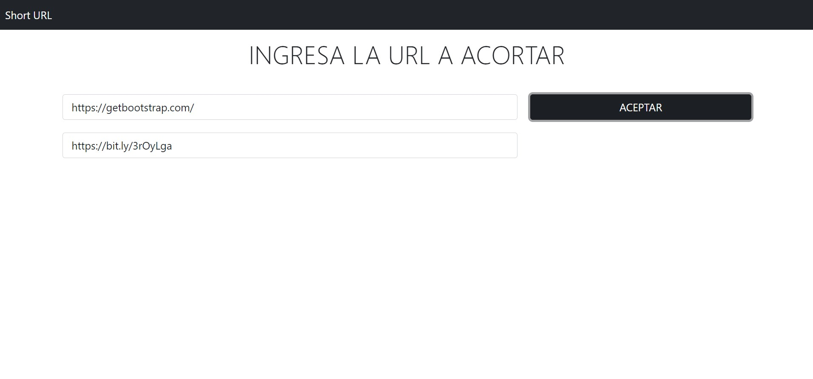

# Angular Short URL

App para acortar una URL implementado en Angular, usando la API de  [Bitly](https://bitly.com/).

## Configuración
Ejecuta `ng serve --o` y navega en `http://localhost:4200/` para visualizar el proyecto.

## Vista Previa

